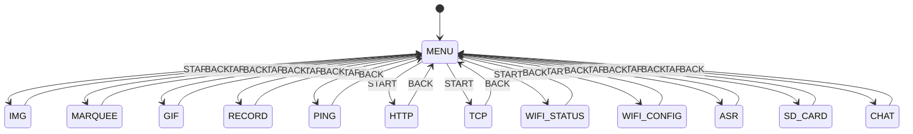
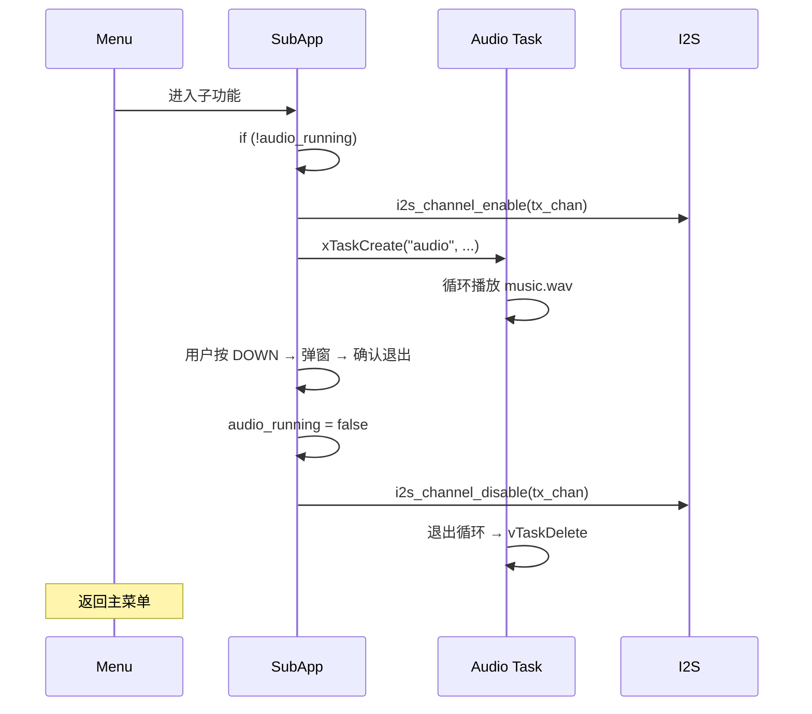

# 应用架构

> 三级状态机 + 退出确认弹窗 + 音频生命周期管理

---

## 1. 整体架构图

```
┌──────────────────────────────────────────────────────┐
│                    box-demo                          │
│                                                      │
│  ┌──────────────────────────────────────────────┐   │
│  │              main loop (app_main)              │   │
│  │                                                │   │
│  │  ┌──────────┐    ┌──────────────────────────┐ │   │
│  │  │ 按键读取  │───→│ 状态机分发 (switch case)  │ │   │
│  │  │read_btns │    │                          │ │   │
│  │  └──────────┘    └──────┬───────┬───────────┘ │   │
│  │                         │       │              │   │
│  │                    ┌────┴──┐ ┌──┴──────────┐  │   │
│  │                    │ 菜单   │ │ 子功能状态  │  │   │
│  │                    │ STATE_ │ │ STATE_IMG / │  │   │
│  │                    │ MENU   │ │ MARQUEE/GIF │  │   │
│  │                    └───────┘ └─────────────┘  │   │
│  └──────────────────────────────────────────────┘   │
│                                                      │
│  ┌─────────────┐  ┌─────────────┐  ┌─────────────┐  │
│  │ I2S0 TX     │  │ SPI3 + DMA  │  │ SPIFFS VFS  │  │
│  │ (音频播放)   │  │ (TFT 推屏)  │  │ (资源读取)   │  │
│  └──────┬──────┘  └──────┬──────┘  └──────┬──────┘  │
│         │                │                │          │
│    MAX98357A         ST7789 TFT       Flash 4MB     │
└──────────────────────────────────────────────────────┘
```

---

## 2. 状态机定义

### 状态枚举（16 个状态）

```cpp
enum AppState {
    STATE_MENU,            // 主菜单 (12 项)
    STATE_IMG,             // 图片浏览器
    STATE_MARQUEE,         // 走马灯
    STATE_GIF,             // GIF 播放器
    STATE_RECORD,          // 录音播放主界面
    STATE_RECORD_CAPTURE,  // 录音界面
    STATE_RECORD_PLAYBACK, // 播放界面
    STATE_PING,            // Ping 测试
    STATE_HTTP,            // HTTP GET 测试
    STATE_TCP,             // TCP Client 测试
    STATE_WIFI_STATUS,     // WiFi 状态
    STATE_WIFI_CONFIG,     // WiFi 配网
    STATE_ASR,             // 语音识别 (4 阶段)
    STATE_SD_CARD,         // SD 卡状态 + 浏览
    STATE_CHAT,            // AI Chat (5 阶段)
};
```

### 状态转换图



### 主循环调度

```cpp
while (1) {
    int btn = read_buttons();
    switch (s_current_state) {
        case STATE_MENU:    handle_menu(btn);           vTaskDelay(10ms); break;
        case STATE_IMG:     handle_img(btn);            vTaskDelay(10ms); break;
        case STATE_MARQUEE: handle_marquee(btn);        vTaskDelay(30ms); break;
        case STATE_GIF:     handle_gif(btn);            vTaskDelay(10ms); break;
        case STATE_RECORD:  handle_record(btn);         vTaskDelay(10ms); break;
        case STATE_RECORD_CAPTURE: handle_record_capture(btn); vTaskDelay(10ms); break;
        case STATE_RECORD_PLAYBACK: handle_record_playback(btn); vTaskDelay(10ms); break;
        case STATE_PING:    handle_ping(btn);           vTaskDelay(20ms); break;
        case STATE_HTTP:    handle_http(btn);           vTaskDelay(20ms); break;
        case STATE_TCP:     handle_tcp(btn);            vTaskDelay(20ms); break;
        case STATE_WIFI_STATUS: handle_wifi_status(btn); vTaskDelay(20ms); break;
        case STATE_WIFI_CONFIG: handle_wifi_config(btn); vTaskDelay(20ms); break;
        case STATE_ASR:     handle_asr(btn);            vTaskDelay(10ms); break;
        case STATE_SD_CARD: handle_sd_card(btn);        vTaskDelay(20ms); break;
        case STATE_CHAT:    handle_chat(btn);           vTaskDelay(10ms); break;
    }
}
```

---

## 3. 退出确认弹窗

所有子功能退出时均弹出确认窗口，防止误触。

### 弹窗样式

```
┌──────────────────────────────┐
│                              │
│       Exit to Menu?          │
│  ──────────────────────────  │
│       Yes: [DOWN]            │
│       No:  [UP]              │
│                              │
└──────────────────────────────┘
```

- 尺寸：240×110 px，屏幕居中
- 背景：深绿色半透明 (0x2104)
- 双层白色边框

### 弹窗状态变量

| 变量 | 对应功能 |
|------|----------|
| `img_exit_popup` | 图片浏览器退出弹窗 |
| `marquee_exit_popup` | 走马灯退出弹窗 |
| `gif_exit_popup` | GIF 播放器退出弹窗 |
| `menu_popup` | 主菜单确认弹窗 |

---

## 4. 功能初始化: `*_need_init` 模式

每个子功能使用 `bool *_need_init` 标志位实现**延迟初始化**（Lazy Init）：

```
第一次进入 handle_*():
  ↓
*_need_init == true ?
  ↓ YES
  初始化 (加载资源、创建 Task 等)
  设置 *_need_init = false
  绘制第一帧
  ↓
后续进入 handle_*():
  *_need_init == false → 直接响应按键
```

| 标志位 | 初始化内容 |
|--------|-----------|
| `img_need_init` | 检测图片数量、清空尺寸缓存、启动音频 |
| `marquee_need_init` | 加载 500×150 raw 文件到 PSRAM、启动音频 |
| `gif_need_init` | 加载 28 帧 PNG 到 PSRAM Sprite 数组、启动音频 |

> 💡 退出子功能时将 `*_need_init = true`，下次进入时重新初始化，确保资源正确释放和重建。

---

## 5. 音频生命周期



### 多子功能复用

`audio_running` 和 `audio_task_handle` 是全局变量，被三个子功能共享：

- **首次进入**任意子功能：创建 `audio_playback_task`
- **后续进入**其他子功能：`audio_running` 已为 true，通过 `i2s_channel_enable` 恢复
- **退出**子功能：只设 `audio_running = false`，不删任务；任务自检后退出

---

## 6. 内存分配策略

| 资源 | 位置 | 大小 | 说明 |
|------|------|------|------|
| PNG 文件缓冲区 | PSRAM (`heap_caps_malloc`) | 动态 | 图片浏览器每次分配/释放 |
| Marquee 像素数据 | PSRAM (`heap_caps_malloc`) | 150 KB | 500×150×2，进入时分配，退出时释放 |
| GIF Sprite 数组 | PSRAM (`LGFX_Sprite`) | ~2.24 MB | 28 帧 × 200×200×2，进入时分配，退出时释放 |
| WAV 音频缓冲 | 栈 (Task) | 1 KB | `int16_t buf[512]`，Task 栈内 |
| 按键状态 | BSS | <10 B | 全局变量 |
| SPIFFS VFS | Flash | ≤4 MB | 资源文件只读 |

---

## 7. 初始化顺序

`app_main()` 中的初始化严格按照依赖关系排序：

```
1. tft.init()          ← 显示初始化（最先，后续可能需要显示错误信息）
2. tft.setRotation(1)  ← 旋转 90° (240×320 → 320×240 横屏)
3. tft.setBrightness(255)
4. I2S 初始化           ← 独立于显示，可并行
5. init_buttons()      ← 依赖 GPIO
6. init_spiffs()       ← 依赖 Flash 分区表
7. draw_menu()         ← 首帧渲染
8. while(1) 主循环
```
