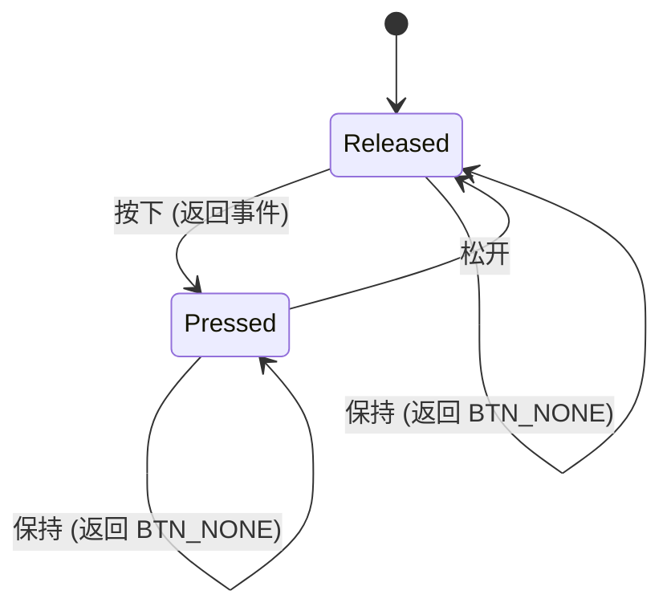

# 按键交互系统

> 6 键 GPIO 直连 + 边沿检测状态机 + 弹窗确认模式

---

## 1. 按键物理接线

| 按键 | GPIO | 模式 | 逻辑 |
|:---:|:---:|------|------|
| **UP**    | GPIO17 | INPUT_PULLUP | 按下 → GND (0), 松开 → 上拉高 (1) |
| **DOWN**  | GPIO3  | INPUT_PULLUP | 同上 |
| **LEFT**  | GPIO8  | INPUT_PULLUP | 同上 |
| **RIGHT** | GPIO18 | INPUT_PULLUP | 同上 |
| **START** | GPIO47 | INPUT_PULLUP | 同上 |
| **BACK**  | GPIO48 | INPUT_PULLUP | 同上 |

```
ESP32-S3                    按键 (轻触开关)
┌──────────────┐
│ GPIO17 (UP)  ├────┬────[按键]──── GND
│ GPIO3 (DOWN) ├────┤
│ GPIO8 (LEFT) ├────┤     每个按键一端接 GPIO
│ GPIO18(RIGHT)├────┤     另一端接 GND
│ GPIO47(START)├────┤
│ GPIO48(BACK) ├────┘
│              │
│ 内部上拉     │          按下 = 低电平(0)
│ (~45kΩ)     │          松开 = 高电平(1)
└──────────────┘
```

### GPIO 选择理由

| GPIO | 按键 | 理由 |
|------|:---:|------|
| **17** | UP | 与 DIJI-NES UP 键一致，不在 Strapping 列表中 |
| **3** | DOWN | 与 DIJI-NES DOWN 键一致 ⚠️ Strapping 引脚（JTAG），运行时安全 |
| **8** | LEFT | 与 DIJI-NES LEFT 键一致，普通 GPIO |
| **18** | RIGHT | 与 DIJI-NES RIGHT 键一致，普通 GPIO |
| **47** | START | 独立于 DIJI-NES，空闲 GPIO，仅输入模式 |
| **48** | BACK | 独立于 DIJI-NES，空闲 GPIO，仅输入模式 |

> ⚠️ **GPIO3 注意事项**：上电瞬间作为 JTAG Strapping 引脚。只要上电时保持默认电平（悬空或上拉），不影响启动。按键按下仅发生在运行时。

---

## 2. 初始化

所有按钮统一配置为 `INPUT_PULLUP`，全程轮询（不使用 GPIO 中断）：

```cpp
static void init_buttons() {
    gpio_config_t io_conf = {};
    io_conf.intr_type = GPIO_INTR_DISABLE;
    io_conf.mode = GPIO_MODE_INPUT;
    io_conf.pull_up_en = GPIO_PULLUP_ENABLE;
    io_conf.pull_down_en = GPIO_PULLDOWN_DISABLE;
    io_conf.pin_bit_mask = (1ULL << BTN_UP) | (1ULL << BTN_DOWN)
                         | (1ULL << BTN_LEFT) | (1ULL << BTN_RIGHT)
                         | (1ULL << BTN_START) | (1ULL << BTN_BACK);
    gpio_config(&io_conf);
}
```

---

## 3. 两层按键架构

```
┌─────────────────────────────────────────────────┐
│                  main loop                       │
│  ┌──────────────┐    ┌──────────────────────┐   │
│  │ read_buttons │    │ gpio_get_level       │   │
│  │ (边沿检测)    │    │ (电平直读)            │   │
│  │ 用于:        │    │ 用于:                 │   │
│  │ · 菜单导航    │    │ · 弹窗确认/取消        │   │
│  │ · 图片翻页    │    │ · 弹窗 armed 判断     │   │
│  │ · 速度调节    │    │                      │   │
│  │ · 打开弹窗    │    │                      │   │
│  └──────┬───────┘    └──────────┬───────────┘   │
│         └───────────┬───────────┘               │
│                     ▼                           │
│            handle_*() / draw_*()                │
└─────────────────────────────────────────────────┘
```

**核心原则**：
- **导航/翻页/调速** → `read_buttons()` 边沿事件。轻触即响应，按住不重复。
- **弹窗确认/取消** → `gpio_get_level()` 直接读电平。不依赖边沿（长耗时绘制会丢边沿）。
- **弹窗保护** → 打开弹窗的按键必须先松手，才能确认/取消。

---

## 4. 边沿检测: `read_buttons()`

### 为什么不用传统时间门控防抖？

传统方案 `if (digitalRead() == LOW && millis() - last > 200)` 在本项目中不可行：
1. 绘图耗时 100~500ms，`millis()` 时间可能跨越防抖窗口
2. 弹窗确认需要按两次，第一次被"吃掉"体验差

### 实现

```cpp
static int prev_btn = BTN_NONE;  // 上一帧状态

static int read_buttons() {
    int curr = BTN_NONE;
    if (gpio_get_level(BTN_UP) == 0)    curr = BTN_U;
    if (gpio_get_level(BTN_DOWN) == 0)  curr = BTN_D;
    if (gpio_get_level(BTN_LEFT) == 0)  curr = BTN_L;
    if (gpio_get_level(BTN_RIGHT) == 0) curr = BTN_R;
    if (gpio_get_level(BTN_START) == 0) curr = BTN_S;
    if (gpio_get_level(BTN_BACK) == 0)  curr = BTN_B;

    int event = (curr != BTN_NONE && curr != prev_btn) ? curr : BTN_NONE;
    prev_btn = curr;
    return event;
}
```

### 状态机



| 场景 | 行为 |
|------|------|
| 按下瞬间 | 返回按键值 |
| 持续按住 | 返回 BTN_NONE（不重复） |
| 松开后再按 | 再次返回按键值 |
| 长耗时绘制后 | 无副作用 |

### 优先级

`read_buttons()` 中用独立 `if`（非 `else if`），最后检查的键优先级最高。当前优先级：BACK > START > RIGHT > LEFT > DOWN > UP。如需严格优先级应改用 `else if` 链，但当前设计通过 `else if` 链确保同时按下只返回一个事件（优先级最高者）。

---

## 5. 盲区补偿: `sync_button_state()`

长时间绘图后（如 GIF 加载 28 帧），`prev_btn` 可能与物理状态不一致，导致误触发。每个 `draw_*()` 末尾调用此函数校准：

```cpp
static void sync_button_state() {
    prev_btn = BTN_NONE;
    if (gpio_get_level(BTN_UP) == 0)       prev_btn = BTN_U;
    else if (gpio_get_level(BTN_DOWN) == 0) prev_btn = BTN_D;
    else if (gpio_get_level(BTN_LEFT) == 0) prev_btn = BTN_L;
    else if (gpio_get_level(BTN_RIGHT) == 0) prev_btn = BTN_R;
    else if (gpio_get_level(BTN_START) == 0) prev_btn = BTN_S;
    else if (gpio_get_level(BTN_BACK) == 0)  prev_btn = BTN_B;
}
```

> `else if` 链确保多键同时按下时只记录一个（优先级：UP > DOWN > LEFT > RIGHT > START > BACK）。

---

## 6. 弹窗确认模式

弹窗确认/取消**必须直读 `gpio_get_level()`**——因为长耗时绘制期间边沿会丢失。各功能的弹窗逻辑在 `main.cpp` 的 `handle_*()` 中实现，统一使用 `draw_exit_popup()` 绘制弹窗 UI。

工作原理：

```
用户按下 DOWN（打开弹窗）→ armed=true
每帧: DOWN 还按着 → armed 保持 true，只绘制
用户松开 DOWN → armed=false
用户再按 DOWN（确认）→ 冷却通过 → 执行动作 ✅
```

关键变量：
| 变量 | 作用 |
|------|------|
| `exit_popup` | 弹窗激活标志 |
| `exit_popup_armed` | `true` = 开启键未松，禁止任何操作 |
| `last_action_time` | 全局。确认/取消后 200ms 内禁止再行动 |

---

## 7. 按键功能映射

| 状态 | UP | DOWN | LEFT | RIGHT | START | BACK |
|------|:--:|:----:|:----:|:-----:|:-----:|:----:|
| **主菜单** | 上移选择 | 下移选择 | — | — | 进入功能 | — |
| **弹窗** | 取消 | 确认 | — | — | — | — |
| **图片浏览器** | — | 退出弹窗 | 上一张 | 下一张 | — | 返回菜单 |
| **走马灯** | — | 退出弹窗 | — | — | 暂停/继续 | 返回菜单 |
| **GIF 播放器** | 加速 | 减速 | — | — | 退出弹窗 | 返回菜单 |
| **ASR 识别** | — | 重新录音 | — | — | 发送识别 | 返回菜单 |
| **Chat** | 退出弹窗 | 上一条 | — | — | 确认发送 | 返回菜单 |

---

## 8. 新增按钮模板

```cpp
// 1. 在 buttons.h 中加宏
#define BTN_OK     GPIO_NUM_X
#define BTN_K      N              // 下一可用事件值

// 2. init_buttons() 中 io_conf.pin_bit_mask 加上 (1ULL << BTN_OK)

// 3. read_buttons() 中加一行:
if (gpio_get_level(BTN_OK) == 0) curr = BTN_K;

// 4. sync_button_state() 中加 else if 分支
```

> `read_buttons()` 中用独立 `if`（非 `else if`），最后检查的键优先级最高。如需严格优先级改用 `else if` 链。
