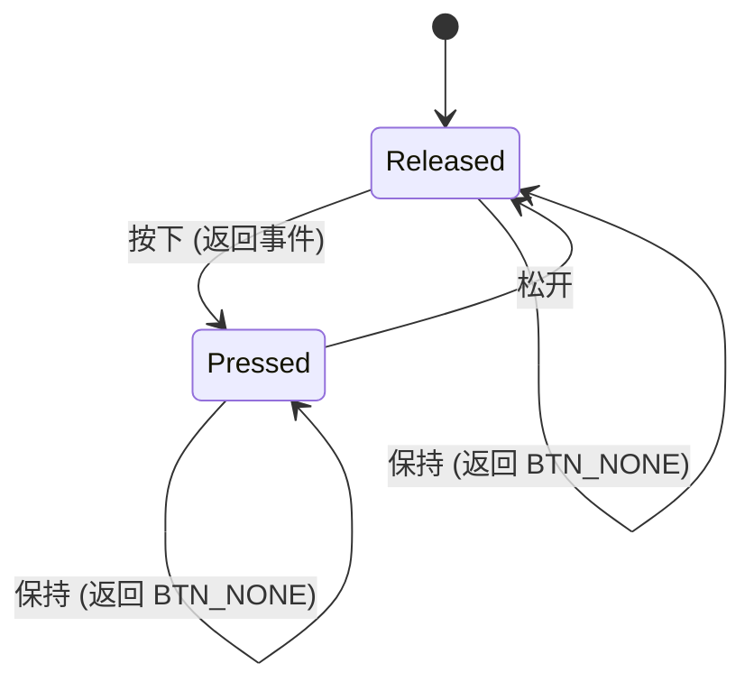

# 按键交互系统

> 4 键 GPIO 直连 + 边缘检测状态机 + 盲区补偿

---

## 1. 按键物理接线

| 按键 | GPIO | 模式 | 逻辑 |
|:---:|:---:|------|------|
| **UP**    | GPIO17 | INPUT_PULLUP | 按下 → GND (0), 松开 → 上拉高 (1) |
| **DOWN**  | GPIO3  | INPUT_PULLUP | 同上 |
| **LEFT**  | GPIO8  | INPUT_PULLUP | 同上 |
| **RIGHT** | GPIO18 | INPUT_PULLUP | 同上 |

```
ESP32-S3                    按键 (轻触开关)
┌──────────────┐
│ GPIO17 (UP)  ├────┬────[按键]──── GND
│ GPIO3 (DOWN) ├────┤
│ GPIO8 (LEFT) ├────┤     每个按键一端接 GPIO
│ GPIO18(RIGHT)├────┘     另一端接 GND
│              │
│ 内部上拉     │          按下 = 低电平(0)
│ (~45kΩ)     │          松开 = 高电平(1)
└──────────────┘
```

### GPIO 选择理由

| GPIO | 理由 |
|------|------|
| **17** (UP) | 与 DIJI-NES UP 键一致，不在 Strapping 列表中 |
| **3** (DOWN) | 与 DIJI-NES DOWN 键一致 ⚠️ **Strapping 引脚**：上电时 JTAG 信号源控制，运行时可安全用作输入 |
| **8** (LEFT) | 与 DIJI-NES LEFT 键一致，普通 GPIO |
| **18** (RIGHT) | 与 DIJI-NES RIGHT 键一致，普通 GPIO |

> ⚠️ **GPIO3 (DOWN) 注意事项**：GPIO3 在上电瞬间作为 JTAG 信号源控制的 Strapping 引脚。只要上电时 GPIO3 保持默认电平（悬空或上拉），不会影响正常启动。按键按下 = GND 仅发生在运行时，不影响启动流程。

### 与 DIJI-NES 按键布局的关系

DIJI-NES 使用完整 NES 8 键布局（A/B/LEFT/RIGHT/UP/DOWN/START/SELECT），本项目仅使用方向键子集 (UP/DOWN/LEFT/RIGHT)，GPIO 编号与其完全一致：

| 按键 | DIJI-NES | box-demo |
|------|:---:|:---:|
| UP    | GPIO17 | GPIO17 ✅ |
| DOWN  | GPIO3  | GPIO3  ✅ |
| LEFT  | GPIO8  | GPIO8  ✅ |
| RIGHT | GPIO18 | GPIO18 ✅ |
| A     | GPIO48 | —       |
| B     | GPIO47 | —       |
| START | GPIO15 | —       |
| SELECT| GPIO16 | —       |

---

## 2. 初始化

```cpp
static void init_buttons() {
    gpio_config_t io_conf = {};
    io_conf.intr_type = GPIO_INTR_DISABLE;       // 不使用中断，轮询读取
    io_conf.mode = GPIO_MODE_INPUT;              // 输入模式
    io_conf.pull_up_en = GPIO_PULLUP_ENABLE;     // 启用内部上拉
    io_conf.pull_down_en = GPIO_PULLDOWN_DISABLE;
    io_conf.pin_bit_mask = (1ULL << BTN_UP) | (1ULL << BTN_DOWN)
                         | (1ULL << BTN_LEFT) | (1ULL << BTN_RIGHT);
    gpio_config(&io_conf);
}
```

---

## 3. 边缘检测按键读取

### 问题：为什么不用传统时间门控防抖？

传统方案（Arduino 常见）：

```cpp
if (digitalRead(BTN) == LOW && millis() - last > 200) { ... }
```

在本项目中不可行，因为：

1. **绘图耗时 100~200ms**：`drawPng()` 解码 + SPI DMA 推屏期间，CPU 在忙，`millis()` 时间可能跨越防抖窗口
2. **弹窗确认需要按两次**：第一次按下被"吃掉"后，第二次才触发，用户体验差

### 解决方案：边沿检测状态机

```cpp
static int prev_btn = BTN_NONE;  // 记录上一帧的按键状态

static int read_buttons() {
    // 1. 读取当前物理状态
    int curr = BTN_NONE;
    if (gpio_get_level(BTN_UP) == 0)    curr = BTN_U;
    if (gpio_get_level(BTN_DOWN) == 0)  curr = BTN_D;
    if (gpio_get_level(BTN_LEFT) == 0)  curr = BTN_L;
    if (gpio_get_level(BTN_RIGHT) == 0) curr = BTN_R;

    // 2. 边沿检测：仅在下沿（松→按）时返回事件
    int event = (curr != BTN_NONE && curr != prev_btn) ? curr : BTN_NONE;
    prev_btn = curr;
    return event;
}
```

### 状态机图



### 特性

| 特性 | 说明 |
|------|------|
| **长按不重复** | 按下后持续按住 → 仅第一次返回事件 |
| **即时响应** | 松开后再次按下 → 立即返回事件 |
| **无时间依赖** | 不依赖 `millis()` 或 `esp_timer_get_time()` |
| **系统卡顿安全** | 即使两帧之间间隔 200ms+，也能正确识别边沿 |

---

## 4. 盲区补偿: `sync_button_state()`

### 问题

长时间绘图（如 GIF 加载 28 帧）后，`prev_btn` 状态可能与物理按键不一致：

```
绘图前: prev_btn = BTN_NONE  (用户未按)
绘图时: 用户按下了 UP 键
绘图后: prev_btn 仍然是 BTN_NONE
        → read_buttons() 看到 curr=BTN_U, prev=BTN_NONE → 错误触发事件！
```

### 解决方案

每个 `draw_*` 函数末尾调用 `sync_button_state()`，将 `prev_btn` 校准为当前物理状态：

```cpp
static void sync_button_state() {
    prev_btn = BTN_NONE;
    if (gpio_get_level(BTN_UP) == 0)       prev_btn = BTN_U;
    else if (gpio_get_level(BTN_DOWN) == 0) prev_btn = BTN_D;
    else if (gpio_get_level(BTN_LEFT) == 0) prev_btn = BTN_L;
    else if (gpio_get_level(BTN_RIGHT) == 0) prev_btn = BTN_R;
}
```

> 💡 `else if` 链确保多键同时按下时只记录一个（优先级：UP > DOWN > LEFT > RIGHT）。

---

## 5. 按键功能映射

| 状态 | UP | DOWN | LEFT | RIGHT |
|------|:--:|:----:|:----:|:-----:|
| **主菜单** | 上移选择 | 下移选择 | — | 确认进入 |
| **主菜单弹窗** | — | — | 取消 | 确认 |
| **图片浏览器** | — | 弹出退出弹窗 | 上一张 | 下一张 |
| **图片退出弹窗** | 取消退出 | 确认退出 | — | — |
| **走马灯** | — | 弹出退出弹窗 | — | — |
| **走马灯退出弹窗** | 取消退出 | 确认退出 | — | — |
| **GIF 播放器** | — | 弹出退出弹窗 | 减速 | 加速 |
| **GIF 退出弹窗** | 取消退出 | 确认退出 | — | — |
