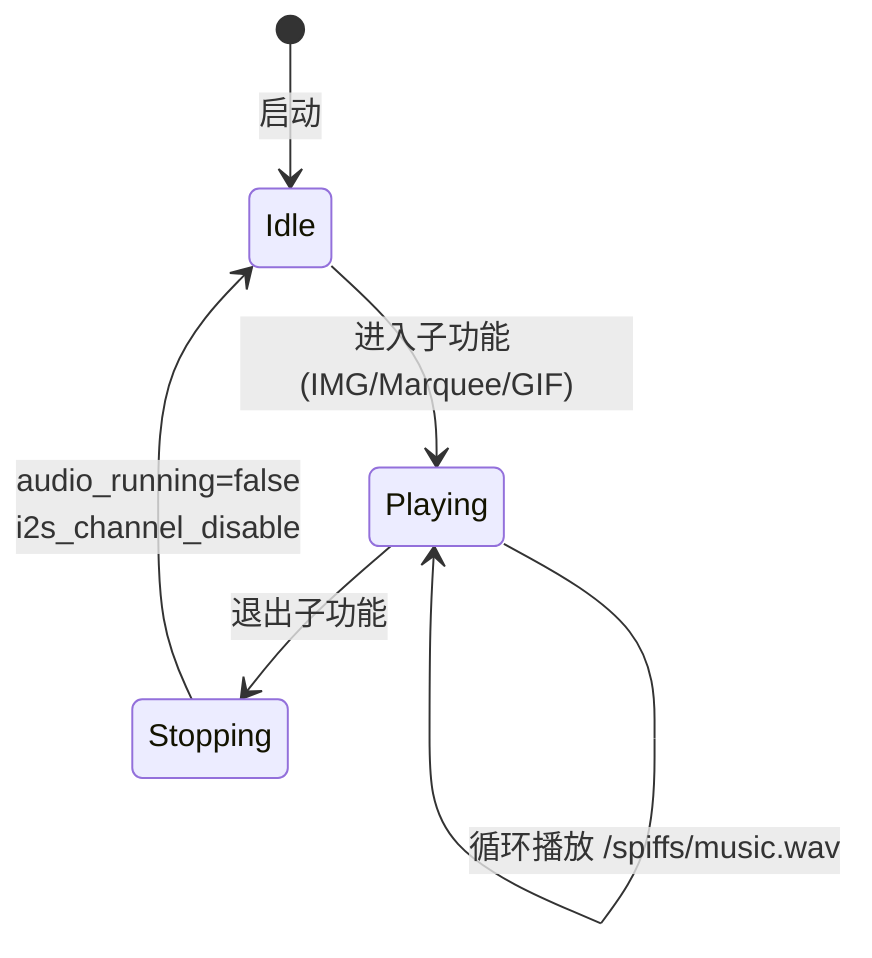

# 音频子系统

> I2S 标准模式 TX → MAX98357A DAC → WAV PCM 循环播放

---

## 1. 硬件接线

|  ESP32-S3 GPIO  | 信号             | MAX98357A 引脚 | 说明         |
| :-------------: | ---------------- | -------------- | ------------ |
| **GPIO5** | BCLK (Bit Clock) | BCLK           | I2S 位时钟   |
| **GPIO4** | LRCLK (WS)       | LRCLK          | 左右声道时钟 |
| **GPIO6** | DATA (DOUT)      | DIN            | I2S 音频数据 |

> 此引脚分配与 DIJI-NES 完全一致，由 DIJI-NES 已验证可靠。

```
ESP32-S3 (I2S0)              MAX98357A 模块
┌──────────────┐           ┌──────────────────┐
│ GPIO5 (BCLK) ├───────────┤ BCLK             │
│ GPIO4 (LRCLK)├───────────┤ LRCLK (FS)       │
│ GPIO6 (DOUT) ├───────────┤ DIN              │
│ 3.3V         ├───────────┤ VDD              │
│ GND          ├───────────┤ GND              │
└──────────────┘           └───────┬──────────┘
                                   │
                              ┌────┴────┐
                              │  Speaker │
                              └─────────┘
```

---

## 2. I2S 配置

```cpp
// I2S0 主机发送模式
i2s_chan_config_t chan_cfg = I2S_CHANNEL_DEFAULT_CONFIG(I2S_NUM_0, I2S_ROLE_MASTER);
i2s_new_channel(&chan_cfg, &tx_chan, NULL);

i2s_std_config_t std_cfg = {
    .clk_cfg  = I2S_STD_CLK_DEFAULT_CONFIG(22050),      // 采样率 22.05 kHz
    .slot_cfg = I2S_STD_PHILIPS_SLOT_DEFAULT_CONFIG(
                    I2S_DATA_BIT_WIDTH_16BIT,            // 16-bit 位深
                    I2S_SLOT_MODE_MONO),                 // 单声道
    .gpio_cfg = {
        .mclk  = I2S_GPIO_UNUSED,    // 不需要主时钟
        .bclk  = GPIO_NUM_5,         // 位时钟
        .ws    = GPIO_NUM_4,         // 左右声道时钟
        .dout  = GPIO_NUM_6,         // 数据输出
        .din   = I2S_GPIO_UNUSED,    // 不需要输入
        .invert_flags = { .mclk_inv = 0, .bclk_inv = 0, .ws_inv = 0 },
    },
};
i2s_channel_init_std_mode(tx_chan, &std_cfg);
```

### 参数总览

| 参数     | 值                 | 说明                 |
| -------- | ------------------ | -------------------- |
| I2S 端口 | I2S_NUM_0          | ESP32-S3 的 I2S0     |
| 角色     | Master (TX)        | 主机发送             |
| 采样率   | **22050 Hz** | WAV 文件匹配         |
| 位深     | **16-bit**   | PCM signed 16-bit LE |
| 声道     | **Mono**     | 单声道               |
| 时钟模式 | Philips Standard   | I2S 标准格式         |
| MCLK     | 未使用             | 由 BCLK 推导         |

---

## 3. 音频播放任务

### 生命周期



### 任务实现

```cpp
static void audio_playback_task(void* arg) {
    const char* path = "/spiffs/music.wav";
    while (audio_running) {
        FILE* f = fopen(path, "rb");
        if (!f) { vTaskDelay(pdMS_TO_TICKS(1000)); continue; }

        fseek(f, 44, SEEK_SET);      // ★ 跳过 WAV 头部 (44 字节)
        int16_t buf[512];             // 512 字节缓冲区

        size_t rd;
        while (audio_running && (rd = fread(buf, 1, sizeof(buf), f)) > 0) {
            size_t wr;
            i2s_channel_write(tx_chan, buf, rd, &wr, portMAX_DELAY);
        }
        fclose(f);
    }
    audio_task_handle = nullptr;
    vTaskDelete(NULL);
}
```

### 关键设计

| 要点                   | 说明                                                                                        |
| ---------------------- | ------------------------------------------------------------------------------------------- |
| **WAV 头部跳过** | 标准 WAV 文件前 44 字节为 RIFF 头部，包含采样率/位深/声道等元信息，PCM 数据从第 45 字节开始 |
| **循环播放**     | 外层`while(audio_running)` + `fseek` 回文件头实现无限循环                               |
| **阻塞写入**     | `portMAX_DELAY` 确保数据不丢失，任务会在 I2S DMA 缓冲区满时自动挂起                       |
| **优雅退出**     | `audio_running = false` → 退出循环 → `vTaskDelete(NULL)` 自删除                       |
| **任务优先级**   | 优先级 1 (idle+1)，不干扰 UI 渲染                                                           |

### 启动与停止

```cpp
// 进入子功能时
if (!audio_running) {
    audio_running = true;
    i2s_channel_enable(tx_chan);
    xTaskCreate(audio_playback_task, "audio", 4096, NULL, 1, &audio_task_handle);
}

// 退出子功能时
audio_running = false;
i2s_channel_disable(tx_chan);
```

> ⚠️ 注意：`xTaskCreate` 只在首次进入子功能时调用；后续进入通过 `i2s_channel_enable` + `audio_running = true` 恢复播放，不重复创建任务。

---

## 4. WAV 文件格式要求

| 参数   | 要求                                    |
| ------ | --------------------------------------- |
| 容器   | RIFF WAV (.wav)                         |
| 编码   | **PCM unsigned/signed 16-bit LE** |
| 采样率 | **22050 Hz**（与 I2S 配置匹配）   |
| 声道   | **Mono**                          |
| 位深   | 16-bit                                  |

- **文件已迁至 `/sdcard/music.wav`**（SD 卡路径）。

---

## 5. MAX98357A DAC 简介

| 参数     | 规格                                 |
| -------- | ------------------------------------ |
| 芯片     | MAX98357A (Maxim Integrated)         |
| 类型     | I2S 输入 / Class-D 放大器            |
| 输出功率 | 3.2W (4Ω, 5V)                       |
| 接口     | 标准 I2S (BCLK + LRCLK + DIN)        |
| 增益     | 可通过 GAIN 引脚配置 (3/6/9/12dB)    |
| 特色     | 无滤波 Class-D, 低 EMI, 无 MCLK 模式 |

> 参考：DIJI-NES 使用同一芯片，本项目直接复用其 GPIO 分配和 I2S 配置。

---

## 6. 与 DIJI-NES 音频方案的异同

| 维度     | DIJI-NES                   | box-demo           |
| -------- | -------------------------- | ------------------ |
| DAC 芯片 | MAX98357A                  | MAX98357A ✅ 相同  |
| GPIO     | 5(BCLK), 4(LRCLK), 6(DATA) | 5, 4, 6 ✅ 相同    |
| I2S 端口 | I2S0                       | I2S0 ✅ 相同       |
| 音频来源 | NES APU 实时合成           | WAV 文件预录制     |
| 播放方式 | 帧级同步推送               | FreeRTOS Task 循环 |
| 采样率   | NES 原生 ~1.79MHz / 可调   | 22050 Hz           |

---

## 7. 录音子系统

本项目同时使用 **I2S1 RX** 进行 MEMS 麦克风录音，与 I2S0 TX 播放完全独立（不同 I2S 端口，不同 DMA）。详见 [录音子系统.md](录音子系统.md)。

### I2S 双工架构

```
I2S0 TX (GPIO 5/4/6) → MAX98357A → 喇叭
I2S1 RX (GPIO 7/15/1) → MEMS Mic → WAV
GPIO2 → MAX98357A SD (功放静音)
```

