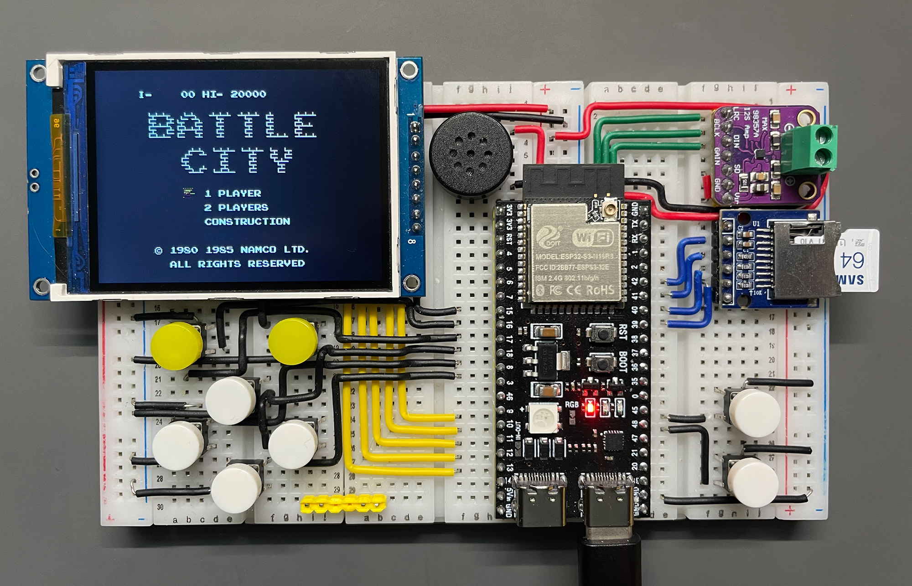
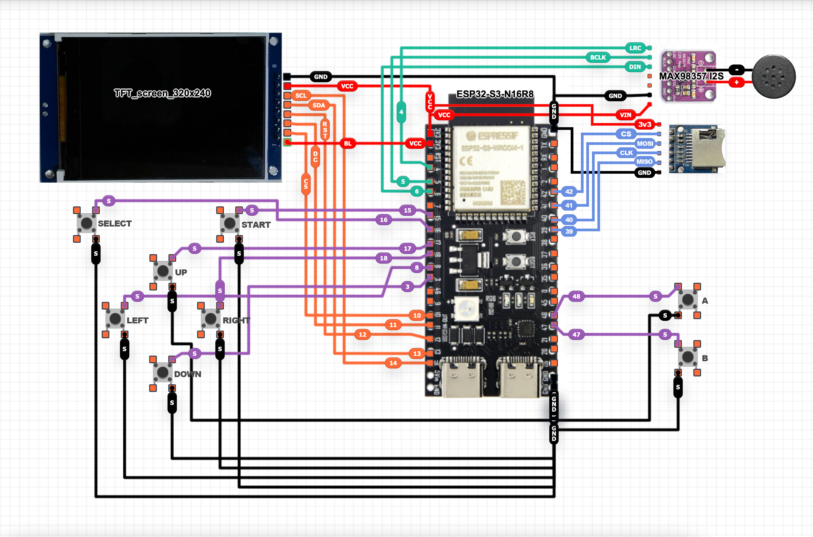

# DIJI-NES

<p align="center">
  
  
  
</p>

> ⚠️ **学习项目 / Learning Project**
> 
> 这是一个用于学习 NES 模拟器原理和嵌入式系统编程的项目。部分功能仍在开发中。
> 
> This is a learning project for understanding NES emulation and embedded systems programming. Some features are still under development.

<p align="center">
   
</p>

---

ESP32-S3 上运行的 NES（任天堂红白机）模拟器，支持显示、音频和控制器。

A NES (Nintendo Entertainment System) emulator running on ESP32-S3 microcontroller with display, audio, and controller support.

---

## ✨ 功能特性

- **完整 CPU 模拟** - 6502 CPU 全指令集 (~150 操作码)
- **PPU 图形** - 背景渲染、滚动、分屏效果、64 个精灵 (8×8 和 8×16 模式)
- **APU 音频** - 方波、三角波、噪声、DMC 通道，通过 I2S DAC 输出
- **双核架构** - Core 0: 音频 + 显示, Core 1: 模拟
- **接近 60 FPS** - 大部分游戏约 57-61 FPS，重精灵场景约 55-58 FPS
- **Mapper 支持** - NROM, MMC1, UxROM, CNROM, MMC3
- **存档功能** - 快速存档/读档到 SD 卡
- **菜单系统** - ROM 浏览器、暂停菜单、无 SD 卡时提示界面，支持 UTF-8 中文 ROM 文件名显示
- **音量控制** - 暂停菜单内提供 5 格图形音量条，每格 20%
- **开机动画** - 黑底白色 DIJI-NES logo 粒子聚合动画
- **友好失败提示** - 不支持的 Mapper 或异常 ROM 会提示后返回主菜单
- **USB CDC 烧录** - ESP32-S3 原生 USB CDC 默认启用，方便通过板载 USB 口烧录和查看串口日志

## Features

- **Complete CPU emulation** - Full 6502 instruction set (~150 opcodes)
- **PPU graphics** - Background rendering, scrolling, split-screen effects, and 64 sprites (8x8 and 8x16)
- **APU audio** - Pulse, triangle, noise, and DMC channels through an I2S DAC
- **Dual-core architecture** - Core 0: audio + display, Core 1: emulation
- **Near 60 FPS** - Most games run around 57-61 FPS; object-heavy scenes are around 55-58 FPS
- **Mapper support** - NROM, MMC1, UxROM, CNROM, MMC3
- **Save states** - Quick save/load to SD card
- **Menu system** - ROM browser, pause menu, no-SD-card prompt, and UTF-8 Chinese ROM filename display
- **Volume control** - 5-block graphical volume bar in the pause menu, 20% per block
- **Boot animation** - White DIJI-NES logo particle animation on a black background
- **Friendly failure messages** - Unsupported mappers or invalid ROMs show a message and return to the main menu
- **USB CDC flashing** - ESP32-S3 native USB CDC is enabled by default for flashing and serial logs through the board USB port

---

## 🎮 兼容性

| Mapper | 名称   | 状态     |
|--------|--------|----------|
| 0      | NROM   | ✅ 正常   |
| 1      | MMC1   | ✅ 正常   |
| 2      | UxROM  | ✅ 正常   |
| 3      | CNROM  | ✅ 正常   |
| 4      | MMC3   | ✅ 大部分正常 |


### 项目状态

本项目已支持 **NES 前期、中期及大部分后期游戏**，包括依赖 MMC3 扫描线 IRQ 的游戏（如超级马里奥 3），以及常见 UxROM/CHR RAM 游戏（如《赤色要塞 / Jackal》）。

少数非标准时序、特殊 mapper 或盗版/改版 mapper 变体的游戏可能仍有兼容性问题。对于明确不支持的 mapper 或异常 ROM，系统会显示提示并返回主菜单。

## Compatibility

| Mapper | Name   | Status |
|--------|--------|--------|
| 0      | NROM   | Supported |
| 1      | MMC1   | Supported |
| 2      | UxROM  | Supported |
| 3      | CNROM  | Supported |
| 4      | MMC3   | Mostly supported |

### Project Status

This emulator now supports **early-, mid-, and most late-era NES titles**, including games that rely on **MMC3 scanline IRQ timing** (e.g., Super Mario Bros. 3) and common UxROM/CHR RAM titles such as Jackal.

A small number of games with non-standard timing, special mappers, or bootleg mapper variants may still have compatibility issues. Clearly unsupported mappers or invalid ROMs will show an error message and return to the main menu.

---

## 📊 性能

| 指标       | 数值          |
|------------|---------------|
| 模拟 FPS   | 大部分游戏约 57-61 FPS；重精灵场景约 55-58 FPS |
| 音频采样率 | 44100 Hz      |
| Flash 使用 | ~803 KB app 固件 (约 12.3% app 分区) |
| RAM 使用   | ~52 KB (16%)  |

> 注：v0.5.0 包含中文 ROM 文件名字体和 1-bit logo bitmap，因此 Flash 占用高于 v0.3.0；静态 RAM 占用基本不变。
>
> v0.3.0 起优先保证精灵显示正确性与横向卷轴边缘稳定性。相比最激进的固定隔帧跳帧方案，部分场景可能低约 1 FPS，但可避免《超级马里奥兄弟》等游戏在受伤/闪烁阶段出现角色消失。
>
> Display 任务会在每帧 DMA 后主动让出时间片以避免 task watchdog 重启，因此部分场景的 DMA 统计值可能略高，但整体 FPS 通常仍保持接近 60。

## Performance

| Metric | Value |
|--------|-------|
| Emulation FPS | Most games around 57-61 FPS; object-heavy scenes around 55-58 FPS |
| Audio sample rate | 44100 Hz |
| Flash usage | ~803 KB app firmware (about 12.3% of the app partition) |
| RAM usage | ~52 KB (16%) |

> Note: v0.5.0 includes a Chinese-capable ROM filename font and a 1-bit logo bitmap, so Flash usage is higher than v0.3.0; static RAM usage is mostly unchanged.
>
> Since v0.3.0, the emulator prioritizes sprite correctness and stable horizontal scrolling edges. Compared with the most aggressive fixed frame-skip mode, some scenes may be about 1 FPS slower, but this avoids disappearing sprites during damage/blinking effects in games such as Super Mario Bros.
>
> The Display task yields after each frame DMA to avoid task watchdog resets. DMA timing may be slightly higher in some scenes, while overall FPS usually remains close to 60.

---

## 🛠️ 硬件需求

| 组件       | 规格                                              |
|------------|---------------------------------------------------|
| **MCU**    | ESP32-S3-N16R8 (双核 240MHz, 16MB Flash, 8MB PSRAM) |
| **显示屏** | ST7789 TFT LCD 320×240 (SPI)                       |
| **音频 DAC** | MAX98357A I2S DAC                                 |
| **存储**   | SD 卡 (FAT32, 存放 ROM 文件)                       |
| **输入**   | 8 个按键 (直连 GPIO)                              |

## Hardware

| Component | Specification |
|-----------|---------------|
| **MCU** | ESP32-S3-N16R8 (dual-core 240MHz, 16MB Flash, 8MB PSRAM) |
| **Display** | ST7789 TFT LCD 320x240 (SPI) |
| **Audio DAC** | MAX98357A I2S DAC |
| **Storage** | SD card (FAT32, stores ROM files) |
| **Input** | 8 buttons (direct GPIO wiring) |

---

<p align="center">
   
</p>

## 📌 引脚配置

### SD 卡
| 功能   | GPIO |
|--------|------|
| CS     | 42   |
| SCLK   | 40   |
| MISO   | 39   |
| MOSI   | 41   |

### 控制器按键
| 按键   | GPIO |
|--------|------|
| A      | 48   |
| B      | 47   |
| SELECT | 16   |
| START  | 15   |
| UP     | 17   |
| DOWN   | 3    |
| LEFT   | 8    |
| RIGHT  | 18   |

### I2S 音频
| 功能   | GPIO |
|--------|------|
| BCLK   | 5    |
| LRC    | 4    |
| DOUT   | 6    |

### TFT 显示屏
| 功能   | GPIO |
|--------|------|
| SCLK   | 14   |
| SDA (MOSI) | 13 |
| DC     | 11   |
| CS     | 10   |
| RST    | 12   |

详见 [lgfx_conf.h](src/lgfx_conf.h) (LovyanGFX 配置)。

⚠️ 注意
部分 TFT 显示屏需要在该文件中启用 颜色反转（invert） 设置，否则可能出现 颜色反了、发白或对比度异常 的情况。
如遇此问题，请在 lgfx_conf.h 中尝试修改：cfg.invert = true;

## Pin Configuration

### SD Card
| Function | GPIO |
|----------|------|
| CS       | 42   |
| SCLK     | 40   |
| MISO     | 39   |
| MOSI     | 41   |

### Controller Buttons
| Button | GPIO |
|--------|------|
| A      | 48   |
| B      | 47   |
| SELECT | 16   |
| START  | 15   |
| UP     | 17   |
| DOWN   | 3    |
| LEFT   | 8    |
| RIGHT  | 18   |

### I2S Audio
| Function | GPIO |
|----------|------|
| BCLK     | 5    |
| LRC      | 4    |
| DOUT     | 6    |

### TFT Display
| Function | GPIO |
|----------|------|
| SCLK     | 14   |
| SDA (MOSI) | 13 |
| DC       | 11   |
| CS       | 10   |
| RST      | 12   |

See [lgfx_conf.h](src/lgfx_conf.h) for the LovyanGFX configuration.

⚠️ Note
Some TFT displays require color inversion (invert) to be enabled in this file.
Otherwise, issues such as inverted colors, washed-out colors, or incorrect contrast may occur.
If you encounter these problems, try modifying the following setting in lgfx_conf.h: cfg.invert = true;


---

## 🚀 编译与上传

### 前置条件

- **VS Code**
- **PlatformIO**（VS Code 扩展）
  https://platformio.org/install/ide?install=vscode
- ESP32-S3 USB 驱动（大多数系统会自动安装）

> ⚠️ **无需手动安装第三方库**  
> 本项目使用 PlatformIO 管理依赖。所有所需库（包括 **LovyanGFX**）将在首次编译时由 PlatformIO 自动下载。

## Build & Upload

### Prerequisites

- **VS Code**
- **PlatformIO** (VS Code extension)  
  https://platformio.org/install/ide?install=vscode
- ESP32-S3 USB driver (most systems install it automatically)

> ⚠️ **No manual third-party library installation required**  
> This project uses PlatformIO for dependency management. All required libraries (including **LovyanGFX**) will be automatically downloaded by PlatformIO during the first build.

---

### 固件文件

为方便直接烧录，仓库根目录提供了预编译合并固件：

- [firmware/DIJI-NES_v0.5.0.bin](firmware/DIJI-NES_v0.5.0.bin)

该文件已合并 **bootloader + partitions + boot_app0 + app firmware**，可直接按地址 **0x0** 烧录。

### Prebuilt Firmware

For convenience, a prebuilt merged firmware image is included in the repository root:

- [firmware/DIJI-NES_v0.5.0.bin](firmware/DIJI-NES_v0.5.0.bin)

This image already contains the **bootloader + partitions + boot_app0 + application firmware**, so it can be flashed directly to address **0x0**.

---

### 方式一：使用 PlatformIO（推荐）

1. 使用 **VS Code** 打开本项目目录
2. PlatformIO 会自动识别项目并安装所需工具链
3. 选择正确的 ESP32-S3 串口设备
4. 点击 PlatformIO 的 **Upload** 按钮进行编译并烧录

> v0.4.0 起 `platformio.ini` 默认启用 `ARDUINO_USB_MODE=1` 和 `ARDUINO_USB_CDC_ON_BOOT=1`，可直接通过 ESP32-S3 原生 USB CDC 端口烧录和监视串口输出。

### Option 1: Using PlatformIO (Recommended)

1. Open this project folder in **VS Code**
2. PlatformIO will automatically detect the project and install the required toolchain
3. Select the correct serial port for your ESP32-S3 board
4. Click **Upload** in PlatformIO to build and flash the firmware

> Since v0.4.0, `platformio.ini` enables `ARDUINO_USB_MODE=1` and `ARDUINO_USB_CDC_ON_BOOT=1` by default, allowing flashing and serial monitoring through the ESP32-S3 native USB CDC port.

---

### 方式二：使用乐鑫 Flash Download Tool 烧录

如果你希望直接烧录预编译固件，可使用乐鑫官方烧录工具：  
下载地址：<https://docs.espressif.com/projects/esp-test-tools/zh_CN/latest/esp32/production_stage/tools/flash_download_tool.html>

1. 启动工具后，将 **ChipType** 选择为 **ESP32S3**，其余选项保持默认。
2. 参考下图勾选并配置烧录项：

   <p align="center">
     
   </p>

3. 选择仓库中的合并固件文件 [firmware/DIJI-NES_v0.5.0.bin](firmware/DIJI-NES_v0.5.0.bin)，烧录地址填写 **0x0**。
4. 确认设备串口连接正常后，点击 **START** 开始烧录。
5. 烧录完成后重启设备，即可进入 DIJI-NES。

### Option 2: Using Espressif Flash Download Tool

If you prefer flashing a prebuilt image directly, you can use Espressif's official Flash Download Tool:  
Download: <https://docs.espressif.com/projects/esp-test-tools/zh_CN/latest/esp32/production_stage/tools/flash_download_tool.html>

1. After launching the tool, set **ChipType** to **ESP32S3** and leave the other options at their default values.
2. Follow the example below to select and configure the flashing items:
   
   <p align="center">
     
   </p>

3. Select the merged firmware file [firmware/DIJI-NES_v0.5.0.bin](firmware/DIJI-NES_v0.5.0.bin) from this repository and set the flash address to **0x0**.
4. After confirming the serial port is connected correctly, click **START** to begin flashing.
5. Reboot the device after flashing completes to start DIJI-NES.

---

### 🛠 常见问题排查

**PlatformIO 卡在 “Resolving dependencies…”**

如果 PlatformIO 在配置项目或解析依赖时卡住，通常是由于 PlatformIO 本地环境损坏、缓存问题或权限异常导致的。
可按下列步骤排查：

- 备份并删除 PlatformIO 主目录（将触发依赖重下载）：

```bash
rm -rf ~/.platformio
```

- 检查并修复目录权限（如果删除失败或出现权限错误）：

```bash
sudo chown -R $(whoami) ~/.platformio
```

- 在终端中验证 PlatformIO 可用并更新元数据：

```bash
platformio update
platformio upgrade
```

- 重新启动 VS Code，必要时重新安装 PlatformIO 扩展。

如果问题仍然存在，参考 PlatformIO 官方文档或查看 VS Code 输出面板中的 PlatformIO 日志以获取详细错误信息。

### Troubleshooting

**PlatformIO stuck at "Resolving dependencies..."**

If PlatformIO gets stuck while configuring the project or resolving dependencies, it is often caused by a corrupted cache, permission issues, or a broken local PlatformIO environment.
Try the steps below:

- Backup and remove the PlatformIO home directory (this forces re-downloading dependencies):

```bash
rm -rf ~/.platformio
```

- Fix ownership/permissions if deletion or access fails:

```bash
sudo chown -R $(whoami) ~/.platformio
```

- Update PlatformIO core and metadata:

```bash
platformio update
platformio upgrade
```

- Restart VS Code and, if needed, reinstall the PlatformIO extension.

If the issue persists, check the PlatformIO output/logs in VS Code for error details and consult the PlatformIO docs.

---

### ⚠️ SD 卡模块注意事项

部分 SD 卡模块自带稳压芯片，而有些则没有。

- 带稳压模块 -> 必须使用 **5V** 供电
- 无稳压模块 -> 只能使用 **3.3V** 供电

⚠️ 给无稳压模块输入 5V 可能会直接损坏 SD 卡或模块。

### SD Card Module Notes

Some SD card modules include an onboard voltage regulator, while others do not.

- Modules with onboard regulator -> must be powered with **5V**
- Modules without regulator -> must use **3.3V only**

⚠️ Supplying 5V to a non-regulated module may permanently damage the SD card or module.

### 🛠️ SD 卡故障排查

**f_mount failed: (3)**

该错误通常表示 SD 卡初始化失败。

可能原因包括：

- SD 卡模块供电不足或电压错误
- 接线问题
- SD 卡类型或格式不兼容

### SD Card Troubleshooting

**f_mount failed: (3)**

This error is commonly related to SD card initialization failure.

Possible causes include:

- Insufficient or incorrect power supply to the SD card module
- Wiring issues
- Incompatible SD card type or format

### 💾 SD 卡兼容性

- SDHC 卡 -> ✅ 支持
- 文件系统：FAT32
- 建议分配单元大小：512 字节
- SDXC 卡 -> ❌ 不支持（库限制）

### SD Card Compatibility

- SDHC cards -> Supported
- File system: FAT32
- Allocation unit size: 512 bytes recommended
- SDXC cards -> Not supported (library limitation)

### 💡 补充说明

如果你遇到 `f_mount failed: (3)`，且确认接线和格式都正确，可以尝试为带稳压的 SD 模块提供 5V 供电。

### Notes

If you encounter `f_mount failed: (3)` and all wiring and formatting appear correct, try supplying 5V to modules with onboard regulators.

### 🙏 致谢

本说明基于社区用户的反馈与实际排查经验整理。

### Acknowledgement

This information is based on community feedback and troubleshooting experience.

---

## 🎮 使用方法

注意：本项目不包含、提供或分发任何游戏 ROM。所有 ROM 均为版权所有，属于各自权利人。
本项目仅供技术学习与研究使用。作者不对用户如何获取或使用 ROM 文件承担任何责任。

1. **准备 ROM 文件**: 将 `.nes` ROM 文件复制到 SD 卡根目录（支持 UTF-8 中文文件名）
2. **插入 SD 卡**
3. **开机**: 设备会显示 ROM 浏览菜单
4. **选择游戏**: 
   - **上/下** 滚动列表
   - **START** 或 **A** 启动游戏
5. **游戏内控制**:
   - **START + SELECT**: 打开暂停菜单
   - 暂停菜单中可继续游戏、调整 5 格音量、保存/读取状态或返回 ROM 浏览器
   - 选中 **Volume** 时，使用 **LEFT/RIGHT** 调节音量

## Usage

This project does NOT include, provide, or distribute any game ROMs. All ROMs are copyrighted and remain the property of their respective owners.
This project is intended solely for technical learning and research. The author assumes no responsibility for how users obtain or use ROM files.

1. **Prepare ROM files**: Copy `.nes` ROM files to the root directory of the SD card (UTF-8 Chinese filenames are supported)
2. **Insert the SD card**
3. **Power on**: The device will show the ROM browser menu
4. **Select a game**:
   - **UP/DOWN** scrolls the list
   - **START** or **A** starts the game
5. **In-game control**:
   - **START + SELECT** opens the pause menu
   - The pause menu lets you continue, adjust the 5-block volume bar, save/load state, or return to the ROM browser
   - When **Volume** is selected, use **LEFT/RIGHT** to adjust volume

---

## 📁 项目结构

```
DiJi-NES/
├── firmware/
│   ├── DIJI-NES_v0.2.1.bin # 旧版预编译合并固件
│   ├── DIJI-NES_v0.3.0.bin # 旧版预编译合并固件
│   ├── DIJI-NES_v0.4.0.bin # 旧版预编译合并固件
│   └── DIJI-NES_v0.5.0.bin # 当前预编译合并固件，可直接烧录到 0x0
├── assets/
│   └── DIJI-NES_logo.png # 开机动画 logo 源图
├── src/
│   ├── main.cpp        # 入口、硬件初始化、主循环
│   ├── logo_bitmap.h   # 1-bit 开机 logo 点阵
│   ├── nes.h/.cpp      # NES 系统总线、内存映射
│   ├── cpu6502.h/.cpp  # 6502 CPU 模拟
│   ├── ppu.h/.cpp      # PPU 图形处理器
│   ├── apu.h/.cpp      # APU 音频处理器
│   ├── cartridge.h/.cpp # ROM 加载、Mapper 实现
│   └── lgfx_conf.h     # LovyanGFX 显示配置
└── platformio.ini      # PlatformIO 配置
```

## Project Structure

```
DiJi-NES/
├── firmware/
│   ├── DIJI-NES_v0.2.1.bin # Previous prebuilt merged firmware
│   ├── DIJI-NES_v0.3.0.bin # Previous prebuilt merged firmware
│   ├── DIJI-NES_v0.4.0.bin # Previous prebuilt merged firmware
│   └── DIJI-NES_v0.5.0.bin # Current prebuilt merged firmware, flashable at 0x0
├── assets/
│   └── DIJI-NES_logo.png # Source logo for the boot animation
├── src/
│   ├── main.cpp        # Entry point, hardware init, main loop
│   ├── logo_bitmap.h   # 1-bit boot logo bitmap
│   ├── nes.h/.cpp      # NES system bus and memory map
│   ├── cpu6502.h/.cpp  # 6502 CPU emulation
│   ├── ppu.h/.cpp      # PPU graphics processor
│   ├── apu.h/.cpp      # APU audio processor
│   ├── cartridge.h/.cpp # ROM loading and mapper implementation
│   └── lgfx_conf.h     # LovyanGFX display configuration
└── platformio.ini      # PlatformIO configuration
```

---

## 🙏 致谢

本项目参考了以下项目的实现方式：

- [Anemoia-ESP32](https://github.com/Shim06/Anemoia-ESP32) - APU 时钟同步策略、帧级调度设计
- [LovyanGFX](https://github.com/lovyan03/LovyanGFX) - 显示库
- [NESdev Wiki](https://www.nesdev.org/wiki/) - NES 硬件文档
- [k7212519](https://github.com/k7212519) - 贡献 UTF-8 中文 ROM 文件名显示支持

特别感谢 Anemoia-ESP32 项目，本项目的 帧级调度设计 和 APU 独立核心运行 + I2S 阻塞同步的设计思路来源于此。

## Acknowledgments

This project references ideas and implementation details from:

- [Anemoia-ESP32](https://github.com/Shim06/Anemoia-ESP32) - APU clock synchronization strategy and frame-level scheduling design
- [LovyanGFX](https://github.com/lovyan03/LovyanGFX) - Display library
- [NESdev Wiki](https://www.nesdev.org/wiki/) - NES hardware documentation
- [k7212519](https://github.com/k7212519) - Contributed UTF-8 Chinese ROM filename display support

Special thanks to Anemoia-ESP32. DIJI-NES's frame-level scheduling design and the APU-on-dedicated-core + I2S blocking synchronization approach were inspired by that project.

---

## 📄 许可证

本项目使用 **GNU General Public License v3.0** (GPLv3) 许可证。

详见 [LICENSE](LICENSE)。

## License

This project is licensed under the **GNU General Public License v3.0** (GPLv3).

See [LICENSE](LICENSE) for details.

---

## 🔮 已知问题

- 某些使用非标准时序的游戏可能有图形问题
- 盗版 ROM 的脏 iNES 头可能导致 mapper 识别错误（已加入自动检测）
- 部分盗版/改版游戏即使 iNES header 标为已支持 Mapper，也可能实际使用特殊变体，可能出现灰屏或无声

## Known Issues

- Some games using non-standard timing may have graphical issues
- Dirty iNES headers in bootleg ROMs may cause mapper detection issues; auto-detection has been added
- Some bootleg or modified ROMs may use mapper variants even when the iNES header reports a supported mapper, and may still show a gray screen or no audio

---

<p align="center">
  <b>Happy Gaming! 🎮</b>
</p>
